# Variational Autoencoders for Stellar Activity Characterization in AU Mic Spectra


<p align="center">
  
</p>

This repository explores **deep learning-based compression of stellar spectra** to disentangle variability induced by **stellar magnetic activity** from potential exoplanet signals. Using **Variational Autoencoders (VAEs)** on high-resolution spectra of **AU Microscopii (AU Mic)** from the **CARMENES VIS_A channel**, we aim to identify and model low-dimensional latent representations of stellar activity signatures.


I analyze **CARMENES VIS_A spectra**, focusing on preprocessed and RV-shifted orders containing activity-sensitive features (e.g., absorption lines around 7137–7140.5 Å - Angstroms), and correlate the learned latent structure with **SNR**, **radial velocity (RV)**, **FWHM**, **contrast**, and **Barycentric Julian Date (BJD)**. Temporal analysis includes **Lomb-Scargle periodograms** and **phase folding**.

---

## Project Objectives

>The scientific goal is to isolate spectral variability due to **dark starspots** and **bright faculae** using unsupervised learning (autoencoders), helping to suppress stellar noise in **Radial Velocity (RV)**-based exoplanet detection.

- Preprocess and normalize telluric-corrected **AU Mic** spectra from CARMENES
- Train deep 1D VAEs on spectral orders to learn meaningful latent encodings
- Apply **data augmentation** via Gaussian noise injection with line protection
- Regularize latent space through **KL annealing**, **dropout**, and **SNR decorrelation**
- Analyze and visualize latent space using **UMAP** and **periodogram analysis**
- Identify and characterize **quasi-periodic temporal structure** in latent dimensions

---

## Project Structure

```plaintext
AUMICAE/
├── configs/
├── data/
│   ├── AUMic/
│   │   ├── CARNIR/
│   │   └── CARVIS/
│   ├── carvis_visA/
│   │   ├── vis_a_files_all.txt
│   │   └── vis_a_files.txt
│   ├── masks/
│   └── meta/
├── notebooks/
│   ├── check_lines/
│   ├── gif_frames/
│   ├── outputs/
│   ├── 01_explore_carvis_visA.ipynb
│   ├── 02_prototype_autoencoder.ipynb
│   ├── 03_latent_analysis.ipynb
│   ├── 04_improve_autoencoder.ipynb
│   ├── 05_metadata_analysis.ipynb
│   ├── 06_snr_mitigation.ipynb
│   ├── 07_ha_activity_lomb_analysis.ipynb
│   ├── 08_carmenes_mask.ipynb
│   ├── 09_vae_fullspectra.ipynb
│   ├── 10_vae_simple.ipynb
│   ├── 11_shift_by_rv.ipynb
│   ├── 12_check_wavegrid.ipynb
│   ├── 13_preprocess_shift_resample_normalize.ipynb
│   ├── 14_run_vae_pipeline.ipynb
│   └── 15_exact_metadata.ipynb
├── src/
│   └── aumic/
│       ├── analysis/
│       │   ├── latent_analysis.py
│       │   └── visualization.py
│       ├── data/
│       │   ├── loader.py
│       │   └── preprocess.py
│       └── models/
│           ├── training.py
│           ├── utils.py
│           └── vae_model.py
├── .python-version
├── poetry.lock
├── pyproject.toml
├── requirements.txt
├── README.md
└── EXPERIMENT_LOG.md
````

Important notebook to set all configurations and run the entire pipeline and visualize the results: `14_run_vae_pipeline.ipynb`.

---

## Environment

* **Python:** 3.11
* **CUDA:** 12.2 (NVIDIA RTX 4060)
* **Package Management:** [Poetry](https://python-poetry.org/)
* **Major Dependencies:**

  * `tensorflow`, `keras`
  * `numpy`, `scikit-learn`, `matplotlib`
  * `astropy`, `umap-learn`, `seaborn`, `scipy`
* GPU-enabled via local Linux machine with poetry virtualenv

> Install via `poetry install`

---

## Modeling Pipeline

### Variational Autoencoder (VAE)

- Encoder produces latent means and log-variances
- Sampling via reparameterization trick
- KL divergence regularization with warmup annealing (`β` schedule)
- Latent dimension size: 16 (however, also tried many different values)

### Architectures

- `SimpleConvVAE1D`: shallow encoder-decoder
- `FullConvVAE1D`: residual blocks, dense layers, tunable filters
- `UNetVAE1D`: skip connections to preserve spatial structure

### Augmentation

- Gaussian noise added to inputs
- Noise **down-weighted** around masked absorption lines
- Configurable protection range (`σ_protect`) and noise minimum

---

## Preprocessing Pipeline

- Use **telluric-corrected spectra**
- Remove spectra with SNR outside ±3σ range
- Apply:
  - **Radial velocity correction** via relativistic Doppler shift
  - **Continuum normalization**
  - **Zero mean subtraction** and **unit variance scaling** (per spectrum)
  - **Spectral cropping** to focus on active regions (e.g., 7137–7140.5 Å)

- Interpolation to a **common wavelength grid**


<p align="center">
  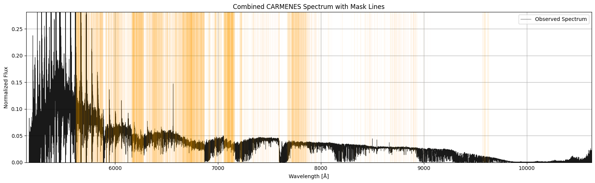
</p>

<p align="center">
  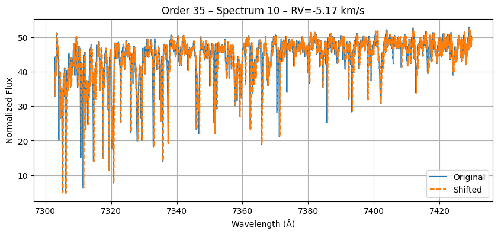<br>
  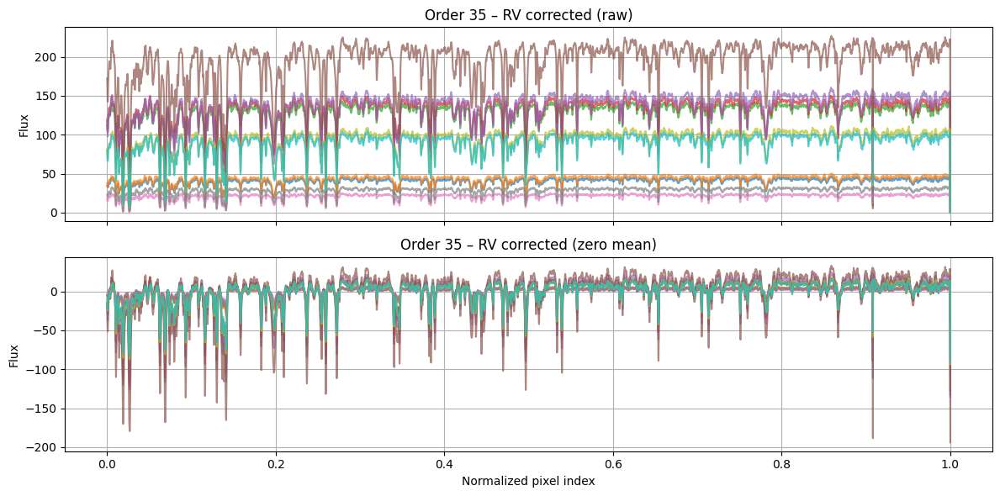<br>
  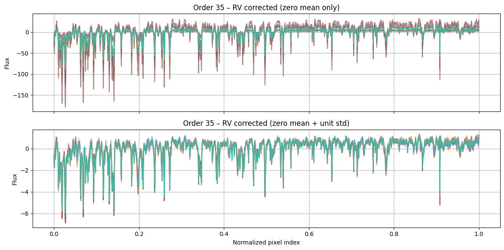
</p>

---

## Analysis and Evaluation

- **Latent vs Metadata**: RV, FWHM, contrast, SNR, BJD visualized in UMAP
- **SNR decorrelation**:
  - Penalized subset of latent dimensions
  - Achieved reduced SNR correlation in final latent space
- **Latent–BJD periodicity**:
  - Lomb-Scargle detects significant signals around **~90 days**
  - Phase-folded views show time-structured variation
- **Reconstruction**:
  - High fidelity even after denoising
  - Full pipeline supports comparison across model types

---

### Modeling Approach
<p align="center">
  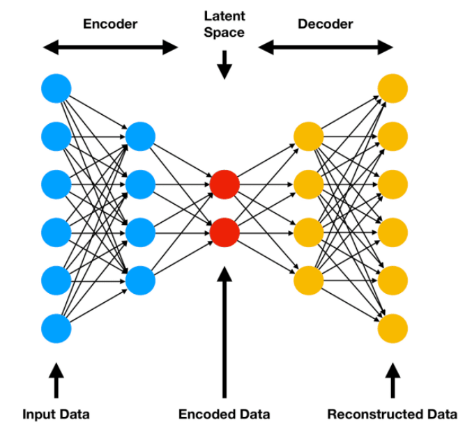
</p>

<p align="center">
  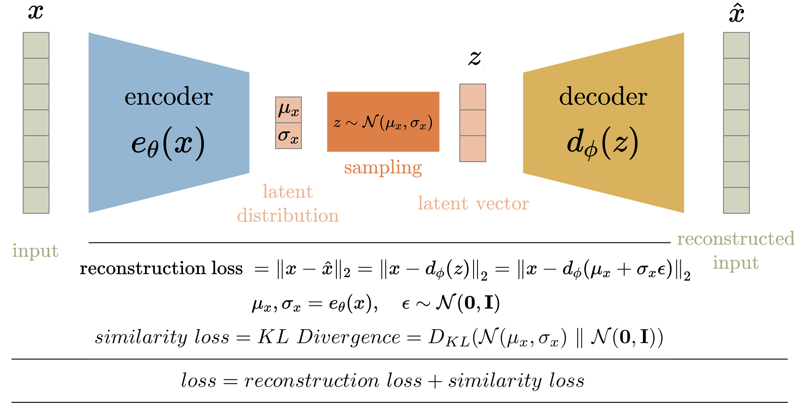
</p>

---

### Example Region (Order 32)
<p align="center">
  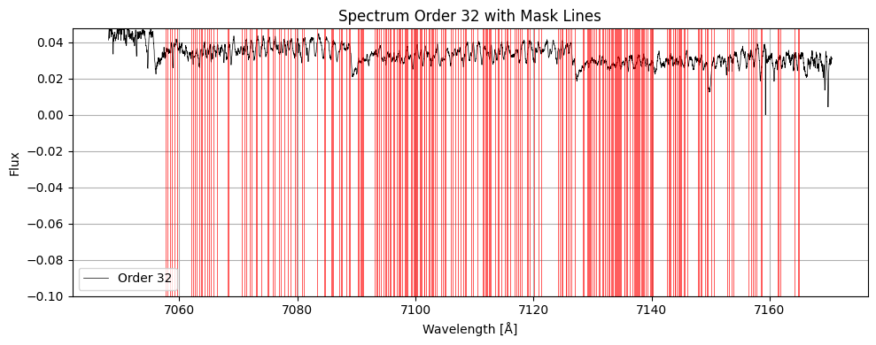<br>
  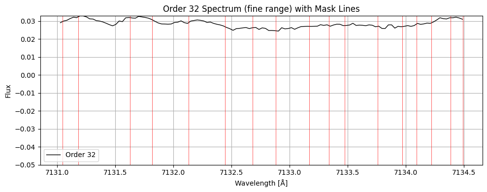
</p>

---

### Latent Space & Metadata
<p align="center">
  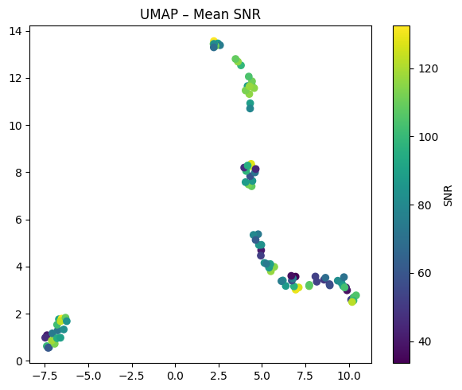<br>
  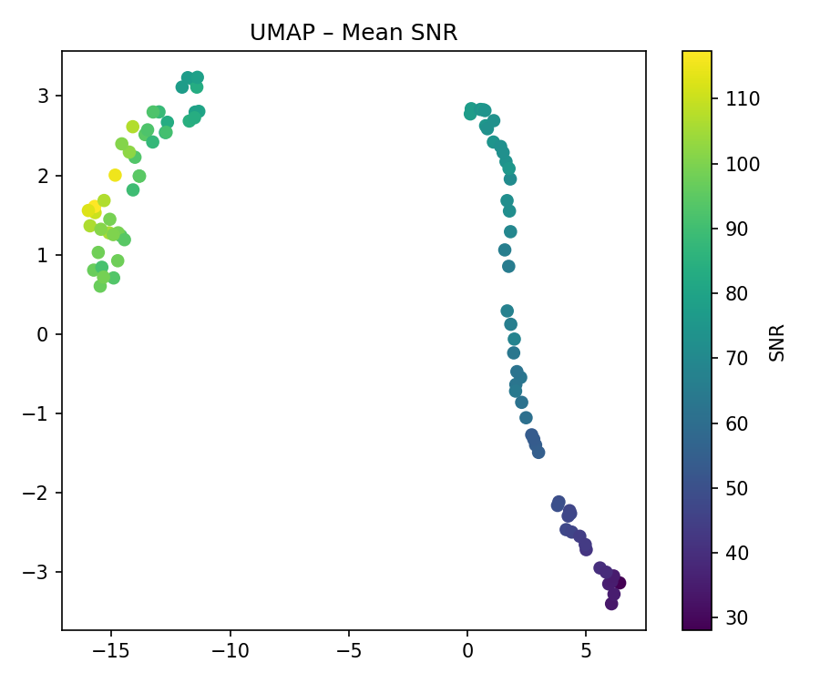<br>
  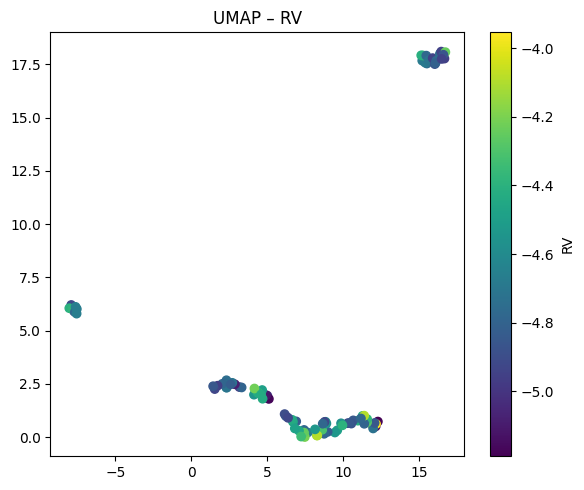<br>
  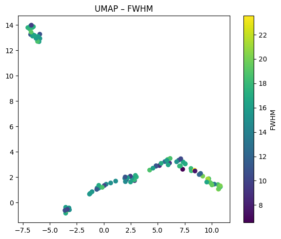<br>
  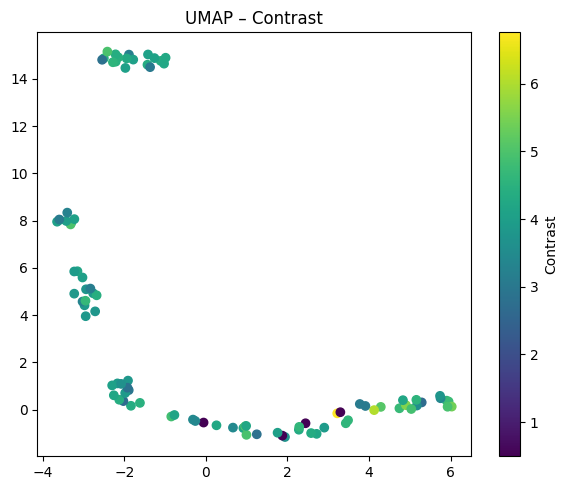<br>
  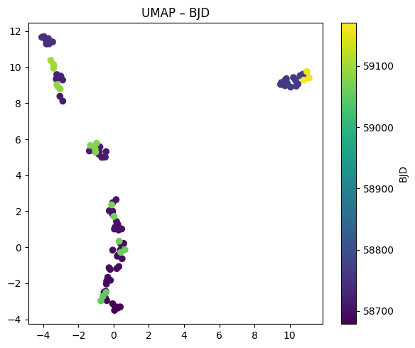<br>
  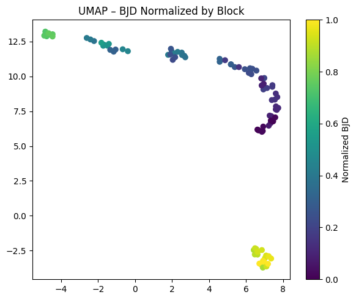
</p>

---

### Temporal Structure
<p align="center">
  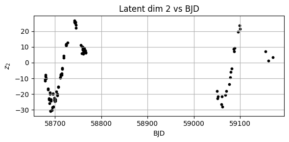<br>
  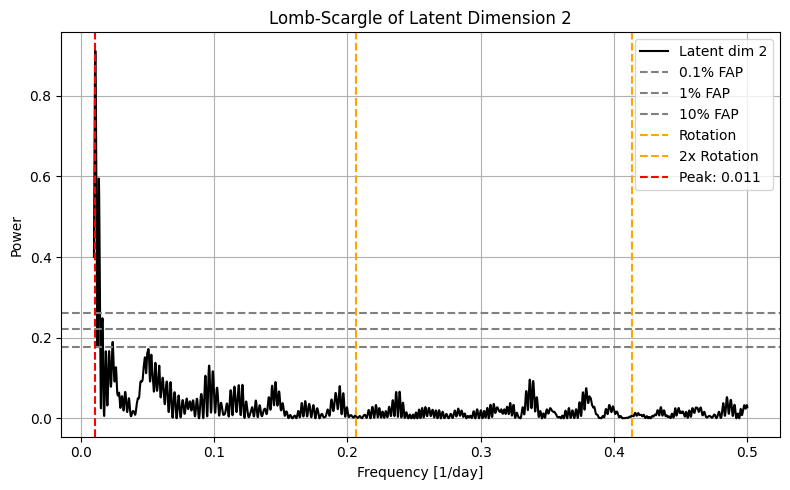<br>
  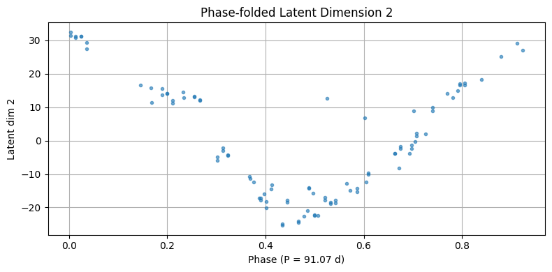
</p>

---

### Reconstructions
<p align="center">
  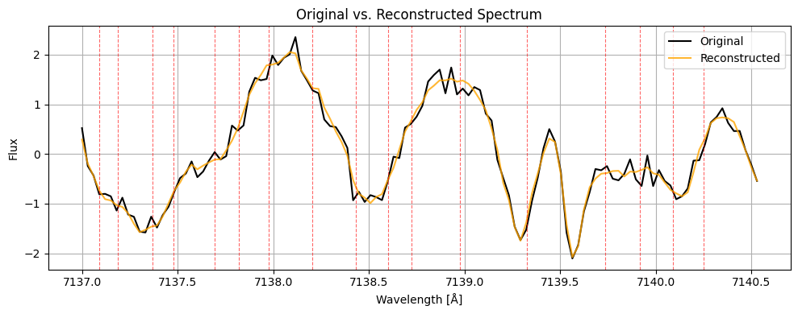<br>
  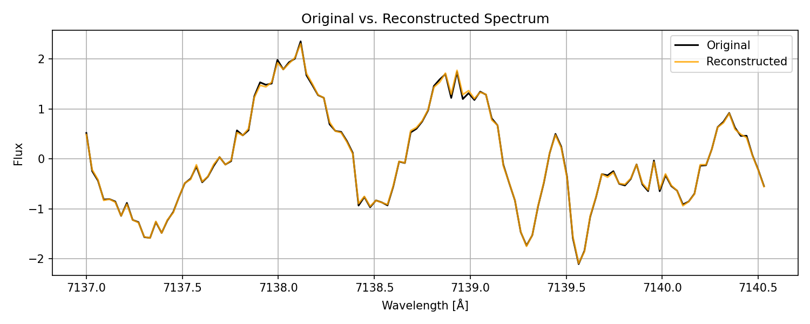
</p>


---

## Key Results

* Latent structure **no longer driven by SNR** - main reason: RV-correction
* Lomb-Scargle periodograms reveal significant **\~90-day periodicity**
* Phase-folded latent dimensions indicate **structured temporal variability**
* VAE reconstructions preserve absorption line structure
* Model generalization improved with denoising and dropout

---

## Next Steps


* Extensive Pretraining once a precise synthetic StarSim dataset is available
* Use **solar spectra** for transfer learning / domain adaptation

---

## Contact

**Marvin Michel Ernst**

*Contact:* [me1020@gmx.de](mailto:me1020@gmx.de)

MSc in Data Science Methodology (Barcelona School of Economics)

Supervised by **Dr. Manuel Perger (ICE-CSIC)**

---
